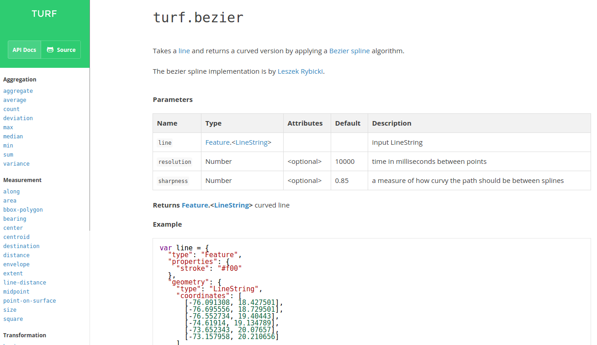
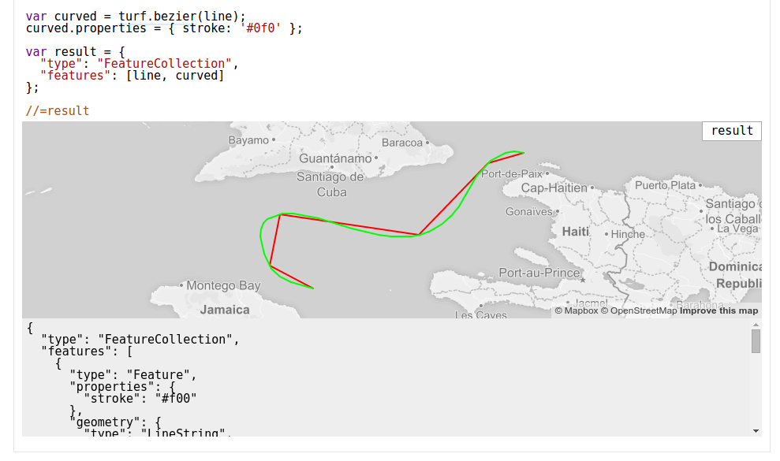

% Intro to Turf.js
% James Seppi | @hydrologee
% MaptimeATX - June 10, 2015

-------------------------------------------------

# Intro to Turf.js

Presentation at [MaptimeATX](http://www.meetup.com/MaptimeATX/events/222643093/)

Viewable at [maptimeatx.github.io/intro-to-turf](http://maptimeatx.github.io/intro-to-turf)

Source code at [github.com/MaptimeATX/intro-to-turf/](https://github.com/MaptimeATX/intro-to-turf/)

# About Turf.js

Project started and managed by [Morgan Herlocker](https://github.com/morganherlocker) (now at [Mapbox](http://mapbox.com))


# About Turf.js

[turfjs.org](http://turfjs.org)

[github.com/turfjs](https://github.com/turfjs)


1280+ stars, 15 owners


# Ok, but what is it?

JavaScript library for **geospatial analysis**

. . .

Runs in web browsers, or in [Node.js](http://nodejs.org)

. . .

Open Source, MIT-licensed

. . .

Collection of small modules

# Modules

Aggregation, Measurement, Transformation, Interpolation, Classification, Joins, Types, and Helpers

. . .

turf-area

. . .

turf-buffer

. . .

turf-distance

. . .

turf-intersect, turf-union, turf-merge

. . .

turf-aggregate, turf-along, turf-average, turf-bbox-polygon, turf-bearing, turf-bezier, turf-center, turf-centroid, turf-combine, turf-concave, turf-convex, turf-count, turf-destination, turf-deviation, turf-envelope, turf-erase, turf-explode, turf-extent, turf-featurecollection, turf-filter, turf-flip, turf-hex-grid, turf-inside, turf-isolines, turf-jenks, turf-kinks, turf-line-distance, turf-line-slice, turf-linestring, turf-max, turf-median, turf-midpoint, turf-min, turf-nearest, turf-planepoint, turf-point, turf-point-grid, turf-point-on-line, turf-point-on-surface, turf-polygon, turf-quantile, turf-random, turf-reclass, turf-remove, turf-sample, turf-simplify, turf-size, turf-square, turf-square-grid, turf-sum, turf-tag, turf-tin, turf-triangle-grid, turf-variance, turf-within

# Data Format

Uses [**GeoJSON**](http://geojson.org) for all data in and out

. . .

**Geographic coordinates** (WGS-84) only

. . .

This means you must first *reproject* and *transform* other data formats to GeoJSON to use it in Turf

# GeoJSON

Standard format for geospatial data on the web

. . .

Point, LineString, Polygon, MultiPoint, MultiLineString, MultiPolygon, GeometryCollection

. . .

Feature, FeatureCollection
(store properties with geometries)

# GeoJSON

```json
{
  "type": "Feature",
  "geometry": {
    "type": "Point",
    "coordinates": [-97.74306, 30.26715]
  },
  "properties": {
    "name": "Austin",
    "population": 885400
  }
}
```

[geojson.org](http://geojson.org)

[geojson.io](http://geojson.io)

GitHub renders it: [github.com/tnris/tx.geojson](https://github.com/tnris/tx.geojson)

# Using Turf

In Node:

```javascript
npm install turf
//or npm install turf-buffer
var turf = require('turf');
//or var buffer = require('turf-buffer');
```

. . .

On your web page

```html
<script src="//api.tiles.mapbox.com/mapbox.js/plugins/turf/v2.0.0/turf.min.js">
</script>
<script>
  var bufferedPoint = turf.buffer(myPoint, 5, 'miles');
</script>
```

# Examples!

Word of Warning: Having too many points or complex features will make rendering or non-responsive

For larger datasets or complex analysis, it is better to do analysis on back-end

-----------------------------------------------------------

```javascript
var austin = turf.point([-97.743061, 30.267153]); //GeoJSON point
var buffered = turf.buffer(austin, 15, 'miles');
result = turf.featurecollection([austin, buffered])
```

<button class="button">Show Demo</button>

-----------------------------------------------------------

```javascript
var austin = turf.point([-97.743061, 30.267153]); //GeoJSON point
var atxBuffer = turf.buffer(austin, 15, 'miles');
var roundrock = turf.point([-97.678896, 30.508255]);
var rrBuffer = turf.buffer(roundrock, 15, 'miles');
result = turf.union(atxBuffer.features[0], rrBuffer.features[0]);
```

<button class="button">Show Demo</button>

-----------------------------------------------------------

```javascript
var austin = turf.point([-97.743061, 30.267153]); //GeoJSON point
var atxBuffer = turf.buffer(austin, 15, 'miles');
var roundrock = turf.point([-97.678896, 30.508255]);
var rrBuffer = turf.buffer(roundrock, 15, 'miles');
result = turf.intersect(atxBuffer.features[0], rrBuffer.features[0]);
```

<button class="button">Show Demo</button>

-----------------------------------------------------------

```javascript
//City of Austin Historical Landmarks
// from https://data.austintexas.gov/Geodata/Historical-Landmarks-Map/6k54-2nnj
display = landmarks.type;
display = 'Num Points: ' + landmarks.features.length;
result = landmarks;
```

<button class="button">Show Demo</button>

Download the Historical Landmarks GeoJSON at [maptimeatx.github.io/intro-to-turf/data/landmarks.geojson](http://maptimeatx.github.io/intro-to-turf/data/landmarks.geojson)

-----------------------------------------------------------

```javascript
var bbox = turf.extent(landmarks);
var grid = turf.squareGrid(bbox, 0.5, 'miles');
var counted = turf.count(grid, landmarks, 'pointCount');
result = counted;
```

<button class="button">Show Demo</button>

-----------------------------------------------------------

```javascript
var bbox = turf.extent(landmarks);
var grid = turf.hexGrid(bbox, 0.5, 'miles');
var counted = turf.count(grid, landmarks, 'pointCount');
result = counted;
```

<button class="button">Show Demo</button>

-----------------------------------------------------------

# Documentation!

Documentation is a top priority for the Turf project



-----------------------------------------------------------

# Documentation!

Built directly from the source code

. . .



-----------------------------------------------------------

# In the Wild

](img/hex_temp_jvrousseau.png)

-----------------------------------------------------------

](img/tornadoes.png)

57,988 tornadoes analyzed over 3,221 counties (in [Node](http://nodejs.org))

-----------------------------------------------------------

](img/iditarod.png)

# Get Involved

Open Source, developed in the open on GitHub: [github.com/turfjs](https://github.com/turfjs)

. . .

Still more work to be done: **docs** to improve, **code** to write, **bugs** to discover, **tests** to write

. . .

Check out the issues: [github.com/turfjs/turf/issues](https://github.com/turfjs/turf/issues) 

# Walkthrough Exercise

**Austin Historic Landmarks**

* GeoJSON: [maptimeatx.github.io/intro-to-turf/data/historic_landmarks.geojson](http://maptimeatx.github.io/intro-to-turf/data/historic_landmarks.geojson)
* Modified from: [data.austintexas.gov/dataset/Historical-Landmarks/nrfx-jets](https://data.austintexas.gov/dataset/Historical-Landmarks/nrfx-jets)

**Austin City Council Districts**

* GeoJSON: [maptimeatx.github.io/intro-to-turf/data/austin_districts.geojson](http://maptimeatx.github.io/intro-to-turf/data/austin_districts.geojson)
* Modified from: [data.austintexas.gov/Government/Single-Member-Council-Districts/69pm-tzkv](https://data.austintexas.gov/Government/Single-Member-Council-Districts/69pm-tzkv)